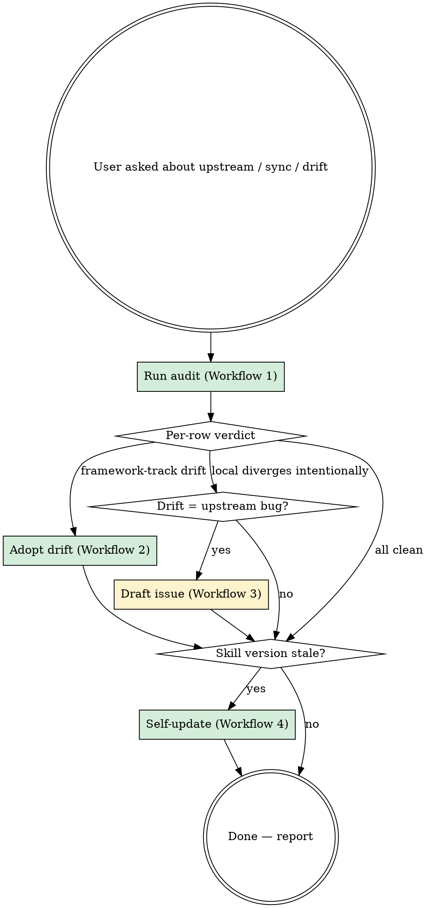

# Devcontainer Upstream Sync

## Overview

This project's `.devcontainer/` and bundled `.claude/skills/` track
[`gatezh/devcontainers`](https://github.com/gatezh/devcontainers) (the
`claude-code` template) as the single source of truth. Upstream evolves —
new postStartCommand wiring (e.g. `patch-playwright-mcp`), new bundled
skills, retired allowlist hosts, image refactors. Without an audit loop
those changes silently rot the local config.

This skill codifies the audit/adopt loop: per-file diff against upstream,
classify drift as intentional vs unwanted, adopt the unwanted, draft
upstream issues for bugs that exist on both sides, and update itself.

## Decision flow



## Sync manifest

Authoritative list of what this skill tracks. Spelled out — do not
discover paths from the filesystem; that misses files that should exist
but don't, and includes files that shouldn't be tracked.

| local path | upstream path | bucket |
|---|---|---|
| `.devcontainer/devcontainer.json` | `claude-code/.devcontainer/devcontainer.json` | framework-track |
| `.devcontainer/docker-compose.yml` | `claude-code/.devcontainer/docker-compose.yml` | starter-customize |
| `.devcontainer/init-plugins.sh` | `claude-code/.devcontainer/init-plugins.sh` | starter-customize |
| `.devcontainer/claude-sandbox/devcontainer.json` | `claude-code/.devcontainer/claude-sandbox/devcontainer.json` | framework-track |
| `.devcontainer/claude-sandbox/docker-compose.yml` | `claude-code/.devcontainer/claude-sandbox/docker-compose.yml` | starter-customize |
| `.devcontainer/claude-sandbox/init-firewall.sh` | `.devcontainer/claude-sandbox/init-firewall.sh` *(repo root, not `claude-code/`)* | exemplar |
| `.claude/skills/sandbox-fetch-docs/SKILL.md` | `claude-code/.claude/skills/sandbox-fetch-docs/SKILL.md` | framework-track |
| `.claude/skills/sandbox-playwright/SKILL.md` | `claude-code/.claude/skills/sandbox-playwright/SKILL.md` | framework-track |
| `.claude/skills/devcontainer-upstream-sync/SKILL.md` | `claude-code/.claude/skills/devcontainer-upstream-sync/SKILL.md` | framework-track |
| `.claude/settings.json` | `claude-code/.claude/settings.json` | starter-customize |
| `mise.toml` | `claude-code/mise.toml` | starter-customize |

### Bucket meanings

- **framework-track** — should match upstream byte-for-byte modulo
  the project-name substitution in §"Customization-preservation rules".
  Drift is a bug to fix locally, or a bug to file upstream if upstream
  has it too.
- **starter-customize** — upstream is a starter template; downstream
  edits are *expected* (project-specific extension lists, allowlists,
  marketplaces, tool versions). Don't auto-overwrite. Surface
  upstream's diff and ask which hunks to adopt.
- **exemplar** — upstream provides a canonical example at a
  *different* path than the framework root. Treat as starter-customize,
  but use the special source path noted in the manifest.

## Customization-preservation rules

When adopting an upstream change, preserve these per-project patterns:

1. **Volume-name prefixes.** Upstream uses `myproject-…`; downstream
   uses `<project>-…`. Read the project name from
   `.devcontainer/docker-compose.yml`'s top-level `name:` field, then
   substitute.
2. **VS Code `extensions` list.** Keep local additions (e.g. Hugo,
   OpenAI Codex). When adopting upstream, only port over upstream's
   *new* additions; don't strip what's local.
3. **`runArgs`** like `--hostname=<project>` — keep verbatim.
4. **`postCreateCommand` / `postStartCommand`.** These chain commands.
   Keep local additions (e.g. `bash .devcontainer/init-plugins.sh`,
   `ln -sfn /workspace/.codex ~/.codex`); sync upstream's *required*
   additions like `/usr/local/bin/patch-playwright-mcp`.
5. **`init-firewall.sh` allowlist** and **`init-plugins.sh` plugin
   list** — never auto-overwrite. Surface upstream's recipe; ask
   before adopting.
6. **`mise.toml` versions.** Versions may legitimately lead or lag
   upstream. Surface; ask.

## Conventions

- Upstream branch is `master` (not `main`).
- Raw URL prefix:
  `https://raw.githubusercontent.com/gatezh/devcontainers/master/`
- Use `gh api` for repo introspection (commits, issues, file listings)
  and `curl -sSL <raw-url>` for plain file fetches.
- All workflows are read-only by default. Apply changes only after
  showing the diff to the user.

## Workflow 1: Audit

Walk the manifest, fetch each upstream file, diff, classify, report.

```sh
# Per-row commands (run for each manifest row):
curl -sSL "https://raw.githubusercontent.com/gatezh/devcontainers/master/${UPSTREAM_PATH}" -o /tmp/upstream-sync/$(basename "${UPSTREAM_PATH}").upstream
diff -u "${LOCAL_PATH}" /tmp/upstream-sync/$(basename "${UPSTREAM_PATH}").upstream || true
```

Classification rules per row:

- Diff is empty → **clean** (or `clean (after project-name substitution)`).
- Diff is non-empty AND row is `framework-track`:
  - If every hunk maps to a customization-preservation pattern → **intentional-customization**.
  - Otherwise → **drift-needs-adopt**. Note the offending hunks.
- Diff is non-empty AND row is `starter-customize` or `exemplar`:
  - **template-divergence**. Show the diff in the report; do not adopt
    automatically.

Report format (one row per manifest entry):

```
✓ .devcontainer/claude-sandbox/devcontainer.json    framework-track    clean
✓ .devcontainer/devcontainer.json                   framework-track    intentional-customization (Hugo extensions, hostname)
⚠ .devcontainer/claude-sandbox/init-firewall.sh     exemplar           template-divergence: see Workflow 2
✗ .claude/skills/sandbox-playwright/SKILL.md        framework-track    drift-needs-adopt: 3 hunks
```

Audit is read-only. Don't apply edits in this phase.

## Workflow 2: Adopt

Driven by Workflow 1's report. For each row that needs action:

### `drift-needs-adopt` (framework-track)

1. Print the diff (already in `/tmp/upstream-sync/…`).
2. Confirm with the user it's not actually intentional.
3. Apply via `Edit` (preserving customization-preservation rules in §3).
4. Stage the file: `git add <local-path>`. Don't commit — let the user
   review and gate.

### `template-divergence` (starter-customize, exemplar)

1. Print the diff.
2. Walk hunks one at a time (or in a small batch) with the user.
3. Apply only the hunks they accept.
4. Stage; don't commit.

### Special cases

- **`init-firewall.sh` (exemplar):** the canonical upstream copy is at
  the **repo root**, not under `claude-code/`. URL is
  `…/master/.devcontainer/claude-sandbox/init-firewall.sh`. The
  `claude-code/` template intentionally omits this file because
  per-project allowlist customization is the whole point.
- **`postStartCommand` chains:** when upstream adds a step (e.g.
  `/usr/local/bin/patch-playwright-mcp`), splice it into the local
  chain rather than overwriting the chain. Verify the binary is in the
  image first:
  ```sh
  docker run --rm --entrypoint /bin/sh \
    ghcr.io/gatezh/devcontainers/claude-code-sandbox:latest \
    -c 'ls -la /usr/local/bin/<binary>'
  ```

## Workflow 3: Draft upstream issue

When Workflow 1 surfaces drift that exists in *both* local and
upstream — i.e. the upstream is shipping a bug — draft an issue.

### Search for existing reports first

```sh
gh issue list --repo gatezh/devcontainers --search '<keyword>' --state all --json number,title,state
gh search issues --repo gatezh/devcontainers '<keyword>' --json title,state,number
```

If a relevant open issue exists, **stop**. Add a comment if needed; do
not file a duplicate.

### Draft the issue body

Save to `docs/upstream-issue-<short-slug>.md` in the project. Use this
template (replace placeholders):

```markdown
## Summary

<one paragraph: what's broken, where it is, what the user-visible
symptom is>

## Reproduction

1. <step>
2. <step>

```
<verbatim error excerpt>
```

## Verification

```
<commands proving the bug>
```

## Suggested fix

<diff or prose>

## Affected files in this repo

- `<upstream path>:<line>`
- `<other upstream path>` (if a sibling copy exists)

## Related

- <other repo / issue references>
```

### Print the file command

```sh
gh issue create --repo gatezh/devcontainers \
  --title "[BUG] <concise title>" \
  --body-file docs/upstream-issue-<short-slug>.md
```

**Do not run the `gh issue create` command.** Filing public issues is a
user action — print the command and let the user run it. The harness
blocks unattended posts to external systems, correctly.

## Workflow 4: Self-update

Check whether this skill itself is up to date.

1. Fetch upstream's frontmatter:
   ```sh
   curl -sSL "https://raw.githubusercontent.com/gatezh/devcontainers/master/claude-code/.claude/skills/devcontainer-upstream-sync/SKILL.md" \
     | head -30
   ```
2. Extract `version:` from upstream and compare to the local file's
   `version:` (this file's frontmatter).
3. If versions match → done.
4. If upstream is newer:
   - Fetch the full upstream SKILL.md to a temp path.
   - `diff -u .claude/skills/devcontainer-upstream-sync/SKILL.md /tmp/upstream-skill.md`
   - Show the diff to the user.
   - On accept: overwrite the local file. **Do not auto-overwrite.**
5. If local is newer (e.g. the user is working on a future version):
   report; do nothing.

## One-time install (for new projects)

For a new downstream project to adopt this skill, paste these three
lines once:

```sh
mkdir -p .claude/skills/devcontainer-upstream-sync
curl -sSL https://raw.githubusercontent.com/gatezh/devcontainers/master/claude-code/.claude/skills/devcontainer-upstream-sync/SKILL.md \
  > .claude/skills/devcontainer-upstream-sync/SKILL.md
git add .claude/skills/devcontainer-upstream-sync/SKILL.md
```

After the one-time copy, the skill manages its own updates via
Workflow 4.

## Out of scope

- **Auto-merging Dockerfile changes.** The Dockerfile is a baked-image
  concern; downstream consumes the image, not the Dockerfile.
- **`init-plugins.sh` semantic merge.** The marketplace and plugin
  lists are legitimately project-specific. Skill surfaces upstream's
  diff and stops.
- **Reverse direction (project → upstream PRs).** Filing issues is in
  scope; opening upstream PRs uses normal `gh pr create` flow, not
  this skill.
