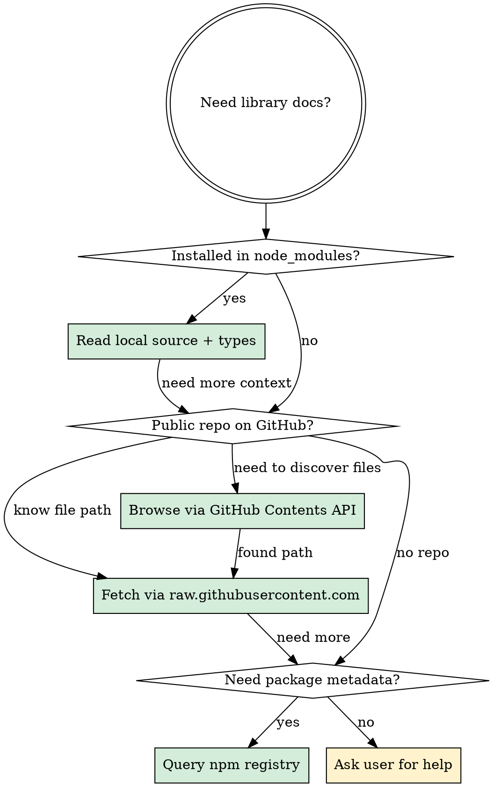

# Fetch Documentation in Sandbox

## Overview

This sandbox only has network access to GitHub and npm registry. All other domains (vendor doc sites, CDNs, search engines) are firewalled. Use these approaches in priority order — do NOT attempt blocked approaches.

## Approach Priority



## 1. Installed node_modules (fastest, always works)

The definitive source for how a library behaves at the exact version you're using:

```bash
# Find the package (Bun layout — other managers use different paths, e.g. node_modules/PACKAGE)
find node_modules/.bun -path "*PACKAGE_NAME*" -type d -maxdepth 3

# Read type definitions (the API contract)
# Look for index.d.mts, index.d.ts, or index.d.cts
Read: node_modules/.bun/PACKAGE@VERSION/node_modules/PACKAGE/dist/index.d.mts

# Read source implementation (how it actually works)
Grep: pattern in node_modules/.bun/PACKAGE@VERSION/node_modules/PACKAGE/dist/index.mjs
```

**When to use:** Always start here. Types show the API contract, source shows the implementation. This is more reliable than docs which may be outdated or describe a different version.

## 2. Raw GitHub content (no auth needed)

Fetch files directly from public repos via `raw.githubusercontent.com`:

```bash
# WebFetch or curl — both work
WebFetch: https://raw.githubusercontent.com/OWNER/REPO/BRANCH/path/to/file.ts

# Common branches to try: main, master, canary
# Example: Resend SDK email handling
WebFetch: https://raw.githubusercontent.com/resend/resend-node/main/src/emails/emails.ts
```

If `main` returns 404, try `master` or `canary`. Use the Contents API (below) to discover the default branch and file paths.

## 3. GitHub Contents API (no auth, ~60 req/hr)

Browse repo structure when you don't know file paths:

```bash
# List directory contents
curl -s https://api.github.com/repos/OWNER/REPO/contents/src/path

# Read repo README
curl -s https://api.github.com/repos/OWNER/REPO/readme

# Get file content (base64-encoded, decode with jq)
curl -s https://api.github.com/repos/OWNER/REPO/contents/path/to/file | jq -r '.content' | base64 -d
```

## 4. npm registry (package metadata only)

```bash
curl -s https://registry.npmjs.org/PACKAGE/latest | jq '.version, .description, .repository'
```

Useful for finding the GitHub repo URL when you don't know it.

## What NEVER works in this sandbox

| Approach | Why |
|----------|-----|
| WebFetch to vendor sites (resend.com, hono.dev, drizzle.team, etc.) | Firewall blocks non-GitHub domains |
| WebSearch | Search engines not whitelisted |
| `gh` CLI | Installed but not authenticated |
| GitHub code search API (`/search/code`) | Requires authentication |
| CDNs (unpkg, jsdelivr, cdnjs) | Not whitelisted |

Do NOT attempt these — they waste time with connection timeouts and auth errors.
