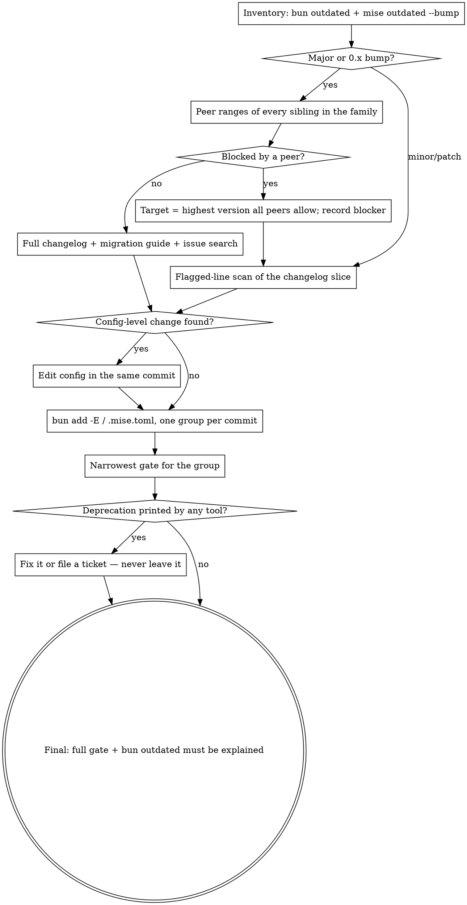

# Upgrading Dependencies

## Overview

Version numbers are the **last** thing you change. Constraints and changelogs
come first, pins are exact, verification is the narrowest gate that covers the
group. "Latest stable" means the latest version the *ecosystem* allows — a
major that two peers forbid is not an upgrade, it is a broken install.

Applies to Bun/npm monorepos with `.mise.toml` tool pins. Read the project's
CLAUDE.md first for its pin style, its verification-cost table, and any
"never touch" files (`bun.lock` is regenerated, never edited).

## Decision flow



## Workflow

### 1. Inventory — every package, every workspace, every tool

```sh
bun outdated --filter '*'      # all workspaces; "Latest" column, not "Update"
mise outdated --bump           # plain `mise outdated` hides versions outside the pinned range
```

Keep a scratch table: package · from · to · kind (major / minor / patch / **0.x**) ·
workspaces. A 0.x package is a major on every minor — treat `0.41 → 0.53` as twelve
majors, not one minor.

### 2. Constraints before versions

For every major or 0.x row, and for every *family* (test runner + its pools and
addons, Babel core + its plugins, auth core + its plugins), read the peer ranges
before choosing a target:

```sh
bunx npm view <pkg>@latest peerDependencies version
bunx npm view <pkg> versions --json | grep '"4\.'   # highest allowed line
```

The target is the highest version every sibling accepts. Write the blocker
down (`vitest stays 4.x: @cloudflare/vitest-pool-workers peers ^4.1`) — the
next upgrade run starts from that note, not from scratch.

A blocker blocks the *family's* major, not its own bump: the pool that pins
vitest to 4.x still moves to its own latest, as long as that latest accepts
the version you are keeping.

### 3. Changelogs, sliced to the range

Run the bundled script per package; it saves the full slice and prints only
the lines that signal work (breaking, deprecated, removed, renamed, migration):

```sh
node .claude/skills/upgrading-dependencies/scripts/changelog-slice.mjs raw wrangler \
  https://raw.githubusercontent.com/cloudflare/workers-sdk/main/packages/wrangler/CHANGELOG.md 4.112.0 4.130.0
node .claude/skills/upgrading-dependencies/scripts/changelog-slice.mjs rel zod colinhacks/zod v 4.4.3 4.6.1
```

- Minor/patch: the flagged lines are enough. Major/0.x: read the whole slice
  **and** the vendor migration guide (`docs/.../<version>-upgrade-guide`,
  `/docs/v8-migration`, a blog post) — changesets rarely carry the "what to do".
- An **empty slice is a wrong tag prefix or heading format, not "no changes"**.
  Monorepos tag per package (`@tanstack/ai@0.53.0`), some use `v`, some
  nothing, some `bun-v`. The script prints the prefixes it saw; fix and rerun.
- Tools outside npm (Hugo, Bun, Node) get the same treatment via `rel`. Their
  breaking changes are usually **config-level** (an allowlist default, a
  permission model) and no typecheck or test will catch them — only the
  release note and the build do.
- Read a changelog against *your* usage: grep the codebase for the API the
  entry names before deciding it does not apply.

### 4. Regression search — for every major and 0.x

Search the upstream repo's issues for the target version and "regression"
(`gh issue list --repo owner/repo --search "<version> regression"` or the
GitHub MCP issue search). A fresh major with an open regression on your code
path is held at the previous version, with the issue link recorded.

Record the outcome per package in the report (§8) — a package with no entry
in the "regression search" column has not been checked.

### 5. Apply in groups, exact pins, one commit each

```sh
cd <workspace> && bun add -E <pkg>@X.Y.Z [--dev]   # never `bun update`, never ^ or ~
# .mise.toml: edit the pin, then `mise install`
```

Group by blast radius: tooling · test stack · UI framework · API libs ·
**auth/security alone** · mise tools alone. A config change a changelog
demanded lives in the same commit as the bump that demanded it. Commit
messages name the blocker or the migration step, so the history explains why.

### 6. Deprecation notices are part of the upgrade

Anything a tool prints during install or build ("Action required", "will be
removed in", "superseded by") is scope: fix it in this branch or file a ticket
with the exact text. Leaving it is how the next upgrade becomes a migration.

### 7. Verify at the right altitude

Per group, run the narrowest gate that covers it: typecheck catches removed
exports and renamed icons; tests catch behaviour; a build catches bundler and
config-level changes; project-specific lanes (workerd tests, storybook build,
static-site build) catch what unit tests cannot. Run the full gate **once** at
the end. Finish with `bun outdated --filter '*'` — every remaining row has a
written reason (peer blocker, regression issue, held on purpose).

### 8. Report

The deliverable is this table, one row per package that appeared in the
inventory (moved or held), every column filled:

| package | from → to | changelog verdict | regression search | config change | gate |
|---|---|---|---|---|---|
| `hugo` | 0.164.0 → 0.165.0 | `security.exec.allow` default dropped tailwindcss | gohugoio/hugo "0.165.0": none relevant | `hugo.yaml` allowlist | `bun run build:www` |
| `vitest` | 4.1.10 → 4.1.11 (held below 5) | patch | — | — | `bun test` |

"held" rows name the blocker or the issue link. A row with an empty
regression-search cell is unfinished work, not a judgement call.

## Quick reference

| Need | Command |
|---|---|
| Real latest, not range-clamped | `bun outdated --filter '*'` (Latest col), `mise outdated --bump`, `mise latest <tool>` |
| Peer compatibility | `bunx npm view <pkg>@latest peerDependencies` |
| Highest version in a major line | `bunx npm view <pkg> versions --json \| grep '"4\.'` |
| Changelog slice | `scripts/changelog-slice.mjs raw\|rel …` (see §3) |
| Package with no public repo / changelog | `bunx npm pack <pkg>@X.Y.Z` and read the tarball |
| Exact pin | `bun add -E <pkg>@X.Y.Z` in the owning workspace |
| Tool pin | edit `.mise.toml`, then `mise install` |

## Common mistakes

| Mistake | Reality |
|---|---|
| Scheduling a major because "Latest" says so | Two peers may forbid it; check the family first, target the highest allowed |
| "0.x minor, low risk" | 0.x minors are majors; read every entry |
| `bun update <pkg>` | Writes a range; the project pins exact — `bun add -E` |
| Deferring majors by reflex ("separate PR later") | Defer on evidence — a peer blocker or an open regression — not on the digit |
| "Two majors in one pass is too risky" | Each group is its own commit and its own gate; a failure traces to the group. Risk is managed by grouping, not by holding |
| Holding the blocker at its old version | The pool that pins vitest 4.x still gets its own latest; only the family's major is held |
| Reading only npm changelogs | Hugo/Bun/Node config-level changes break builds silently |
| Empty changelog slice → "no changes" | Wrong tag prefix or heading style; the script tells you what it saw |
| Bumping the auth library with the UI batch | Auth gets its own commit and its own test lane |
| Leaving "Action required" notices for next time | They compound; fix or ticket now |
| Running the full gate after every group | Use the project's cost table; narrowest gate per group, full gate once |
